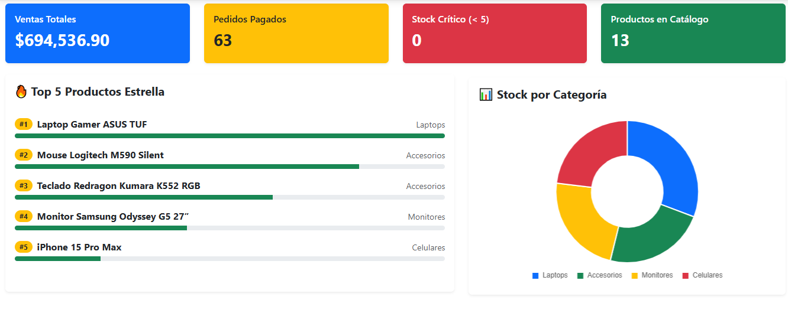

# TechShop - Frontend 🛒

Interfaz de usuario moderna para el sistema de e-commerce TechShop, desarrollada con las últimas tecnologías web.

## 🚀 Stack Tecnológico

* **Framework:** Angular 20.0 (Vanguardia)
* **Estilos:** Bootstrap 5.3 & Bootstrap Icons
* **Gráficos:** Chart.js & ng2-charts (Para dashboards de ventas)
* **Alertas:** SweetAlert2
* **Seguridad:** Comunicación segura mediante JWT Interceptors

## 📄 Funcionalidades Implementadas

* **Dashboard Administrativo:** Visualización de métricas de ventas con gráficos dinámicos.
* **Carrito de Compras Reactivo:** Gestión de ítems en tiempo real con RxJS.
* **Flujo de Pago:** Integración completa con el backend de Spring Boot.
* **Gestión de Sesión:** Autenticación persistente y segura.

## 📊 Panel de Control Administrativo
Vista previa del dashboard de gestión con indicadores en tiempo real y estadísticas de productos.

## 🛠️ Instalación

1. Clonar repositorio.
2. Ejecutar `npm install`.
3. Iniciar con `npm start` o `ng serve`.

---

## 🔗 Repositorios del Proyecto
* **Frontend (Este repositorio):** [https://github.com/jcast2023/techshop-frontend](https://github.com/jcast2023/techshop-frontend)
* **Backend (API Spring Boot):** [https://github.com/jcast2023/techshop-backend](https://github.com/jcast2023/techshop-backend)
